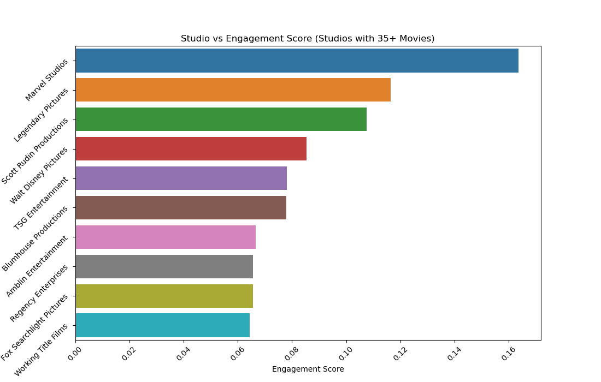
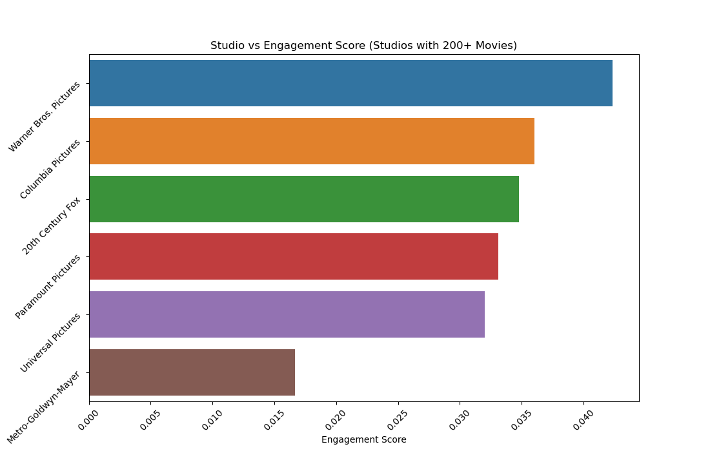
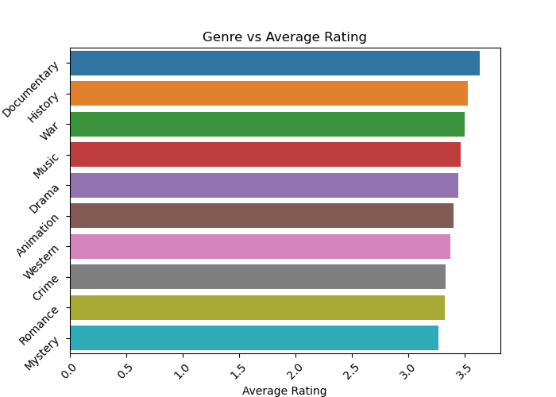
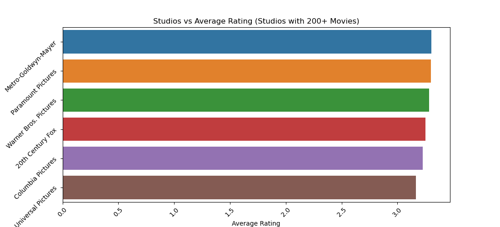
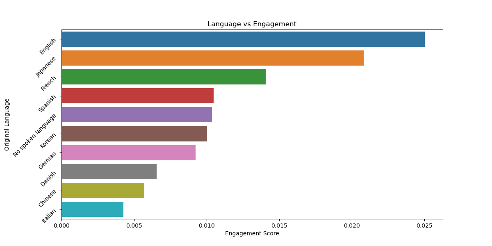

# 🎬 Letterboxd Movie Analysis: What Drives Engagement?

## 📌 Project Overview
This project explores a rich dataset of movies from Letterboxd (sourced via Kaggle), containing features such as title, genres, runtime, director, language, ratings, and detailed engagement metrics like watches, likes, list appearances, and fans.

As a cinema enthusiast and Letterboxd user, I wanted to dive deeper into what drives user interaction (engagement) and how that relates to viewer satisfaction (ratings). The goal is to uncover actionable, business-relevant insights that streaming platforms or studios could use to improve content strategy.

---
### 🧰 Tools Used

- `Python`, `pandas` – data cleaning, transformation, and feature engineering

- `seaborn`, `matplotlib` – visualizations

- `scikit-learn` – used `MinMaxScaler` to engineer a normalized Engagement Score metric

## ⚙️ Preprocessing & Feature Engineering

- **Cleaned the dataset:** renamed columns, dropped duplicates, and exploded multi-value columns (Genres, Studios) for detailed analysis.

- Created a custom `Engagement Score` using Watches, List_appearances, Likes, and Fans, normalized via `MinMaxScaler` from `scikit-learn` library. This allowed me to quantify interaction intensity across different movies and categories.

## 🔍 Key Analyses & Insights

### 🎯 1. Engagement vs Average Rating
A weak-to-moderate positive correlation (r = 0.31) exists between engagement and average rating.

Movies with higher engagement tend to be rated slightly better — but engagement is not a strong predictor of quality.

✅ Business Insight: Popularity doesn’t always reflect satisfaction — some films may go viral but receive mixed reviews.

### 🎭 2. Effect of Genre on Engagement
Certain genres like `Family`, `Adventure` and `Animation` show higher engagement on average. On the other hand, `Dramas` have the lowest average `Engagement Score` in the dataset, which could be explained by their large number—since there are so many, individual titles may receive less attention.

✅ Insight: Genre matters when targeting engagement — some genres may drive more interaction. 

---
### 🏢 3. Studio Influence on Engagement

Studios often play a key role in shaping audience perception through branding, marketing, and production consistency. To evaluate their effect on user interaction, I analyzed studios that produced at least 35 and 200 movies, respectively. This thresholding was necessary to eliminate outliers — for instance, a studio with just one blockbuster could skew results without reflecting consistent performance.

### ✅ Findings

**Studios with 35+ Movies:**

- Marvel Studios stands out as the clear leader in engagement score. The consistency and popularity of its content result in a strong average.

- Walt Disney Pictures ranks 4th, which is notable considering its large film count. Its ability to maintain high engagement across a wide portfolio indicates strong brand loyalty and market reach.

**Studios with 200+ Movies:**

- Warner Bros. Pictures leads in engagement, demonstrating both high volume and high interaction — a difficult balance to achieve.

- Other high-output studios tend to show lower average engagement, likely due to broader, more varied catalogs that dilute overall performance.

**📌 Interpretation:** Studios with established franchises and global reach (e.g., Marvel, Disney, Warner Bros.) tend to generate higher engagement, possibly due to stronger audience anticipation and marketing efforts.

---

### 📈 4. Genre and Studio Impact on Average Rating

**📌 Interpretation:**
- The differences in average rating across genres and studios are minimal.

- No genre or studio consistently outperforms others in terms of rating.

- This suggests that viewer satisfaction is more dependent on the individual movie itself, rather than its genre or the studio behind it.

### 🌍 5. Language Analysis

To explore whether the original language of a film influences its reception, I analyzed the top 10 most common languages in the dataset and compared both their average engagement scores and average ratings.

    
    

- **Average Rating:**
  
> There is no meaningful difference in ratings across languages — most fall within a similar range. This indicates that critical reception is relatively language-independent.

- **Engagement Score:** Language shows a stronger effect on engagement

> English and Japanese films exhibit significantly higher engagement scores.
> French also performs better than others, while some languages (e.g., Italian, Chinese) show relatively lower engagement.

### ⏱️ 6. Does Runtime Affect Engagement?

To investigate how a movie’s duration affects its engagement, I used `pd.qcut()` to group runtimes into four balanced bins:

- `Short`, `Medium`, `Long`, and `Very Long`

This approach ensures that each bin contains roughly the same number of movies for fair comparison.

**📌 Interpretation:**
- Contrary to common assumptions, longer movies received significantly more engagement.

- `Very long` films had the highest average engagement score, while short movies performed the worst.

- This result was surprising, as shorter content is often believed to perform better due to decreasing attention spans.

**✅ Business Insight:**
- Rather than avoiding longer runtimes, studios and platforms may consider that longer films can drive deeper viewer involvement, possibly due to richer narratives, franchise loyalty, or premium content positioning.

    
    

